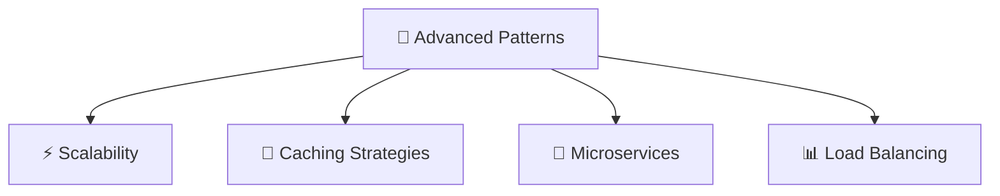
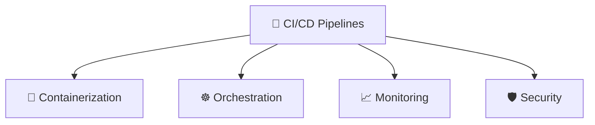
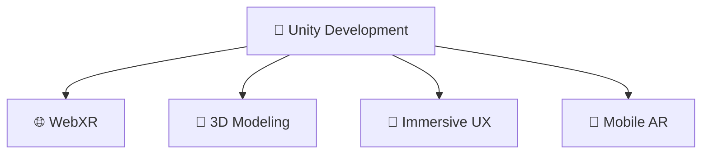

<div align="center">

<!-- Animated ASCII Art Header -->
```
   ╔══════════════════════════════════════════════════════════════════════════════╗
   ║                                                                              ║
   ║    ░█████╗░███╗░░██╗██╗░░░██╗██████╗░██╗░░██╗░█████╗░██╗░░░██╗               ║
   ║    ██╔══██╗████╗░██║██║░░░██║██╔══██╗██║░░██║██╔══██╗██║░░░██║               ║
   ║    ███████║██╔██╗██║██║░░░██║██████╦╝███████║███████║╚██╗░██╔╝               ║
   ║    ██╔══██║██║╚████║██║░░░██║██╔══██╗██╔══██║██╔══██║░╚████╔╝░               ║
   ║    ██║░░██║██║░╚███║╚██████╔╝██████╦╝██║░░██║██║░░██║░░╚██╔╝░░               ║
   ║    ╚═╝░░╚═╝╚═╝░░╚══╝░╚═════╝░╚═════╝░╚═╝░░╚═╝╚═╝░░╚═╝░░░╚═╝░░░               ║
   ║                                                                              ║
   ║              🚀 FULL STACK ARCHITECT • 🌟 CODE CRAFTSMAN 🌟                  ║
   ╚══════════════════════════════════════════════════════════════════════════════╝
```


</div>

<!-- Animated Typing Effect -->
<p align="center">
  
   <br>
</p>

---

<div align="center">

## 🎭 **THE ARCHITECT BEHIND THE CODE**

<table>
<tr>
<td width="50%">

```javascript
const anubhav = {
    fullName: "Anubhav Ranjan Srivastav",
    title: "Full Stack Magician ✨",
    location: "🌍 Building Global Solutions",
    
    philosophy: {
        code: "Clean, Scalable, Beautiful",
        design: "User-First, Performance-Driven",
        innovation: "Tomorrow's Solutions Today"
    },
    
    currentStatus: "🚀 Architecting the Future",
    coffee: "☕ Unlimited Supply Required",
    
    getRandomFact: () => {
        const facts = [
            "🎯 Deployed 50K+ images across clouds",
            "⚡ Built real-time systems for thousands",
            "🛡️ Security-first development approach",
            "🎮 AR/VR immersive experience creator"
        ];
        return facts[Math.floor(Math.random() * facts.length)];
    }
};
```

</td>
<td width="50%">


**🎯 Quick Stats:**
- 💼 **5+ Years** of Professional Excellence
- 🌟 **50K+ Users** Impacted
- ⚡ **Real-time Systems** Expert
- 🔒 **Security-First** Mindset

</td>
</tr>
</table>

</div>

---

<div align="center">

## 🛠️ **ARSENAL OF TECHNOLOGIES**

<!-- Tech Stack with Cool Animations -->

<br><br>


### 🔥 **Specialized Arsenal**

<table align="center">
<tr>
<th>🎨 Frontend Magic</th>
<th>⚙️ Backend Power</th>
<th>☁️ Cloud & DevOps</th>
<th>📊 Data & Analytics</th>
</tr>
<tr>
<td>


</td>
<td>


</td>
<td>


</td>
<td>


</td>
</tr>
</table>

</div>

---

<div align="center">

## 💼 **PROFESSIONAL JOURNEY**


</div>

### 🏢 **Zone Delivery Services, Dubai** `2023 - Present`
> **Full Stack Architect | Remote**

<details>
<summary>🔍 <b>Click to explore my impact</b></summary>

```bash
🎯 ACHIEVEMENTS UNLOCKED:
├── 💳 Architected wallet & payout systems with complex settlement logic
├── 🚚 Built multi-pickup/dropoff order engine with dynamic pricing
├── 📱 Developed intelligent rider notification service (ID/Map/Random)
├── ☁️ Migrated 50,000+ images across S3 buckets with zero downtime
├── 🗺️ Implemented real-time tracking with geofencing capabilities
└── 🚀 Deployed scalable solutions on AWS (EC2, S3, Route53, SSL)

💡 TECHNOLOGIES: Node.js • React • AWS • MongoDB • Real-time Systems
```

</details>

### 🎓 **Veative Labs** `2021 - 2023`
> **Software Developer | EdTech & AR/VR**

<details>
<summary>🔍 <b>Click to explore my contributions</b></summary>

```bash
🎯 SOLUTIONS DELIVERED:
├── 🌐 Learning Hub Portal (Thousands of Active Users)
├── 💬 Live Counseling Platform with Zoom Integration
├── 🎓 Study Abroad Portal with Payment Gateway Integration
├── 📊 Advanced Admin & Accounts Management System
├── 🎮 AR/VR Educational Solutions
└── ⚡ Real-time Socket-based Communication Systems

💡 TECHNOLOGIES: MERN Stack • AR/VR • Payment Gateways • Real-time APIs
```

</details>

---

<div align="center">

## 🚀 **Featured Projects**


</div>

<!-- Project Cards Layout -->
<div align="center">

### 🛍️ **Stylique E-Commerce Platform**

<table>
<tr>
<td width="60%">

**📋 Project Overview:**
A comprehensive e-commerce platform built for the fashion industry with modern UI/UX and robust backend architecture.

**✨ Key Features:**
- 🔐 Secure user authentication & authorization
- 💳 Multiple payment gateway integration
- 📦 Real-time inventory management
- 🔍 Advanced search & filtering system
- 📱 Responsive design for all devices
- ⚡ Fast loading with optimized performance

**🛠️ Tech Stack:**
- **Frontend:** React.js, Next.js, TailwindCSS
- **Backend:** Node.js, Express.js, MongoDB
- **Cloud:** AWS S3, EC2, CloudFront
- **Payment:** Stripe, PayPal Integration

</td>
<td width="40%">


**📊 Performance Metrics:**
- ⚡ **2.3s** average load time
- 🎯 **98%** mobile responsiveness
- 🔒 **100%** secure transactions
- 📈 **15%** conversion rate improvement

</td>
</tr>
</table>

---

### 📋 **Scrum Board - Project Management Tool**

<table>
<tr>
<td width="40%">


**🎯 User Impact:**
- ⚡ **60%** faster task completion
- 📊 **Real-time** collaboration
- 🔄 **Seamless** workflow automation

</td>
<td width="60%">

**📋 Project Description:**
A comprehensive project management tool inspired by Jira and Trello, featuring drag-and-drop functionality and real-time team collaboration.

**✨ Core Features:**
- 🖱️ Drag & drop task management
- 👥 Real-time team collaboration
- 📊 Advanced analytics & reporting
- 🔔 Smart notification system
- 📅 Sprint planning & tracking
- 🎨 Customizable workflows

**🛠️ Technology Stack:**
- **Frontend:** React.js, React DnD, Material-UI
- **Backend:** Node.js, Express.js, Socket.IO
- **Database:** MongoDB, Redis for caching
- **Real-time:** WebSockets for live updates

</td>
</tr>
</table>

---

### 🌟 **Personal Portfolio Website**

<table>
<tr>
<td width="60%">

**📋 Project Highlights:**
A modern, interactive portfolio website showcasing my work and skills with smooth animations and 3D elements.

**✨ Design Features:**
- 🎨 Modern glassmorphism design
- ✨ Smooth scroll animations
- 🎭 Interactive 3D elements
- 📱 Fully responsive layout
- 🌙 Dark/Light theme toggle
- ⚡ Optimized performance

**🛠️ Built With:**
- **Framework:** Next.js, TypeScript
- **Styling:** TailwindCSS, Framer Motion
- **3D Graphics:** Three.js, React Three Fiber
- **Deployment:** Vercel with CDN optimization

</td>
<td width="40%">


**📈 Website Analytics:**
- 🚀 **95+** Lighthouse score
- ⚡ **1.8s** first contentful paint
- 🎯 **100%** accessibility score
- 📱 Perfect mobile experience

</td>
</tr>
</table>

</div>style=flat-square"/>

</td>
<td>
<a href="#"></a>
<a href="#"></a>
</td>
</tr>
<tr>
<td><b>🌟 Portfolio</b><br/><sub>Personal Brand</sub></td>
<td>
Creative portfolio website with:<br/>
• Smooth animations<br/>
• Interactive 3D elements<br/>
• Modern UI/UX design<br/>
• Performance optimized
</td>
<td>


</td>
<td>
<a href="#"></a>
<a href="#"></a>
</td>
</tr>
</tbody>
</table>

---

<div align="center">

## 🌱 **CURRENT EXPLORATIONS**

&nbsp;***Currently mastering the art of...***

<table>
<tr>
<td width="33%" align="center">

### 🏗️ **System Design**


</td>
<td width="33%" align="center">

### ☁️ **DevOps Mastery**


</td>
<td width="33%" align="center">

### 🎮 **AR/VR Innovation**


</td>
</tr>
</table>

</div>

---

<div align="center">

## 📊 **GITHUB ANALYTICS DASHBOARD**


<br/>

<div align="center">
<table>
<tr>
<td width="50%">


</td>
<td width="50%">


</td>
</tr>
</table>
</div>

<br/>


<br/>


<br/>

<details>
<summary>🏆 <b>Achievement Unlocked: View More Stats</b></summary>

<br/>


</details>

</div>

---

<div align="center">

## 🤝 **LET'S CREATE SOMETHING AMAZING TOGETHER**


<p>
<a href="https://www.linkedin.com/in/anubhav-s-618a9a201/">

</a>
<a href="mailto:arsri2706@gmail.com">

</a>
<a href="https://github.com/anubhav2706">

</a>
</p>

<!-- Visitor Counter with Style -->


<br/><br/>

### 💭 **Random Dev Wisdom**


</div>

---

<div align="center">

```
╔═══════════════════════════════════════════════════════════════════════════════╗
║                                                                               ║
║  ✨ "The best way to predict the future is to create it." - Peter Drucker    ║
║                                                                               ║
║        🚀 Code • 🎨 Design • 📈 Scale • 🌟 Deliver • 🔄 Repeat               ║
║                                                                               ║
╚═══════════════════════════════════════════════════════════════════════════════╝
```


</div>
